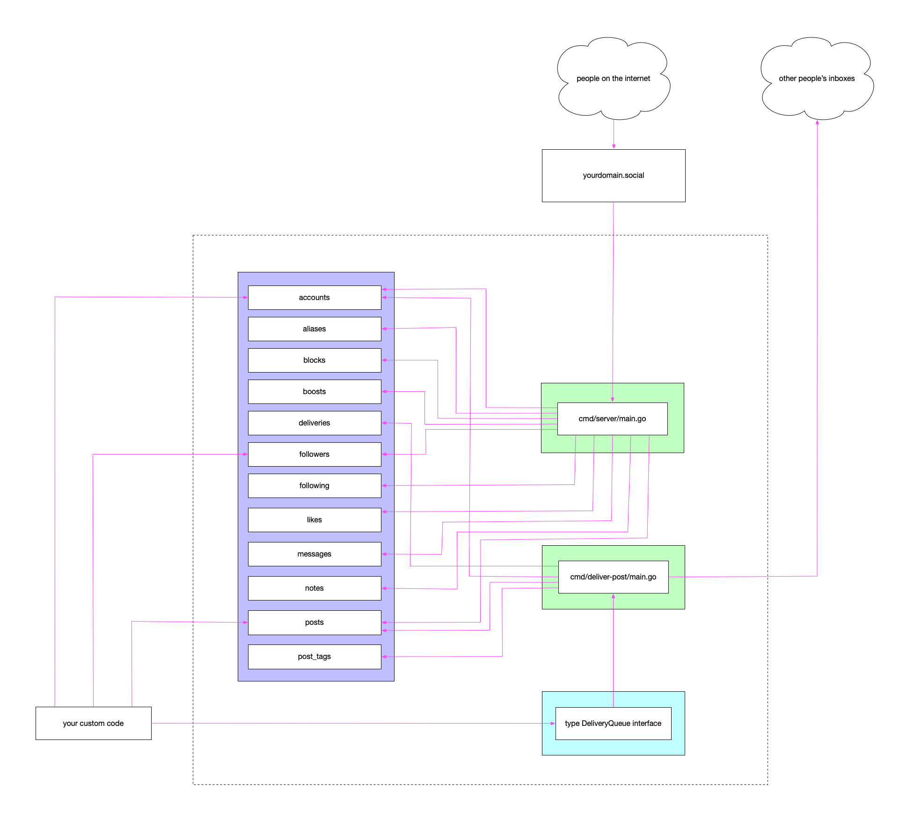

# go-activitypub

An opionated (and incomplete) ActivityPub service implementation in Go.

## Background

The ["Holding Hands with the "Fediverse" – ActivityPub at SFO Museum"](https://millsfield.sfomuseum.org/blog/2024/03/12/activitypub/) blog post is a good place to start. It is a long, but thorough, discussion of why, what and how SFO Museum is thinking about ActivityPub in relation to its collection and digital initiatives.

## Documentation

The documentation for this package (and in particular `godoc`) is incomplete reflecting the nature of our work to first understand the mechanics, and second explore the tolerances, of the ActivityPub protocols.

In advance of more comprehensive documentation we have set a GitHub “Discussions” group where people can ask questions or offer suggestions:

* https://github.com/orgs/sfomuseum/discussions/1

## Motivation

This is on-going and exploratory work to develop a limited "social media" style ActivityPub service. Although it is not necessarily "stable" in the sense that the code base may still change, without any guarantee of backwards compatibility, it does work and is currently deployed (in an experimental fashion) in production.

I find the documentation for ActivityPub very confusing. I don't think I have any problem(s) with the underlying specification but I have not found any implementation guides that haven't left me feeling more confused than when I started. This includes the actual ActivityPub specifications published by the W3C which are no doubt thorough but, as someone with a finite of amount of competing time to devote to reading those specs, often feel counter-productive. Likewise, working implementations of the ActivityPub standards are often a confusing maze of abstractions that become necessary to do everything defined in the specs. There are some third-party guides, listed below, which are better than others but so far each one has felt incomplete in one way or another.

Importantly, the point is not that any of these things are "bad". They clearly aren't as evidenced by the many different working implementations of the ActivityPub standards in use today. The point is that the documentation, as it exists, hasn't been great for _me_. This repository is an attempt to understand all the moving pieces and their relationship to one another by working through the implementation of a simple ActivityPub service. It is incomplete by design and, if you are reading this, it's entirely possible that parts of it remain incorrect.

The goal is implement a basic web service and a set of command line tools which allow:

* Individual accounts to be created.
* The ability for one account to follow, or unfollow, one another.
* The ability for one account to block, or unblock, another account.
* The ability for one account to post a message and to have that message relayed to one or more other accounts.
* The ability for one account to see all the messages that have been delivered to them by other accounts.
* The ability for an account to receive "boosts" and record them.
* The ability for messages to be processed, out of bounds, after receipts using a messaging queue.

That's it, at least for now. It does have support for ActivityPub account migration, editing posts or notifications of changes to posts.

## How does ActivityPub work?

This section has been moved in to the [docs/README.v1.md](docs/ACTIVITYPUB.md) document.

## The Code

This is now the second iteration of the code and a major refactoring of the first. Specifically:

* The code has been updated to deliver arbitrary ActivityPub "activities" rather than just "posts" (which are the internal representation of ActvityPub "notes"). This is the first attempt at separating the generic ActivityPub mechanics from the specifics of a social media style web application. At some point those mechanics will get moved in to their own package and/or this package will be renamed.
* Moving relevant code in to domain-specific sub-packages, most notably the [database](database) packages.
* Improved separations of concerns between the different components in order to facilitate the ease of reasoning about what any piece of the codebase does. This work is not complete and is blocked on still needing to figure out how and where things should live while preventing Go import cycle conflicts.

### Architecture

Here is a high-level boxes-and-arrows diagram of the core components of this package:

There are four main components:

1. A database layer (which is anything implemeting the interfaces for the "databases" or "tables" discussed below)
2. A queueing layer which is anything that implements the "delivery queue" interface discussed below)
3. A [cmd/deliver-post](cmd/deliver-post/main.go) application for delivering messages which can be run from the command line or as an AWS Lambda function
4. A [cmd/server](cmd/server/main.go) application which implements a subset of the ActvityPub related resources. These are: A `/.well-known/webfinger` resource for retrieving account information; Individual account resource pages; Individual account "inbox" resources; Minimalistic "permalink" pages for individual posts.

Importantly, this package does _not_ implement ActivityPub "outboxes" yet. It is assumed that individual posts are written directly to your "posts" database/table and then registered with the delivery queue explicitly in your custom code. That doesn't mean it will always be this way. It just means it's that way right now. Take a look at [cmd/create-post](cmd/create-post/main.go) and [app/post/create](app/post/create) for an example of how to post messages manually.

For example, imagine that:

* The purple box is an AWS DynamoDB database (with 12 separate tables)
* The blue box is an AWS SQS queue
* The green boxes are AWS Lambda functions. The `cmd/server` function will need to be configured so that it is reachable from the internet whether that means it is configured as a Lambda Function URL or "fronted" by an API Gateway instance; those details are left as an exercise to the reader.

However, this same setup could be configured and deployed where:

* The purple box is a MySQL database (with 12 separate tables)
* The blue box is a plain-vanilla "pub-sub" style queue
* The green boxes are long-running daemons on a plain-vanilla Linux server

The point is that the code tries to be agnostic about these details. As such the code tries to define abstract "interfaces" for these high-level concepts in order to allow for a multiplicity of concrete implementations. Currently those implementations are centered on local and synchronous processes and AWS services but the hope is that it will be easy (or at least straightforward) to write custom implementations as needed.

These interfaces are discussed further below.

### Databases

Documentation for databases has been moved in to [database/README.md](database/README.md)

### Queues

Documentation for databases has been moved in to [queue/README.md](queue/README.md)

### Example

This documentation has moved in to [docs/EXAMPLE.md](docs/EXAMPLE.md)

## See also

